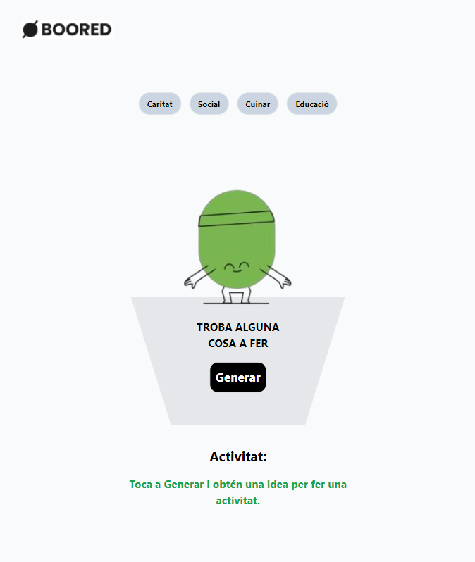
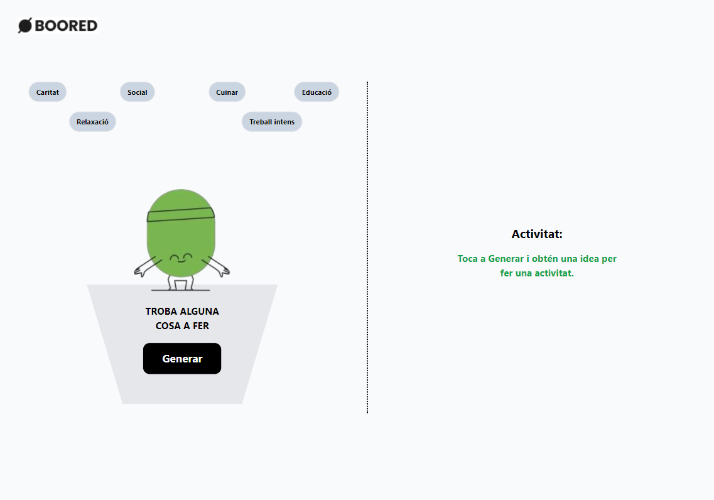
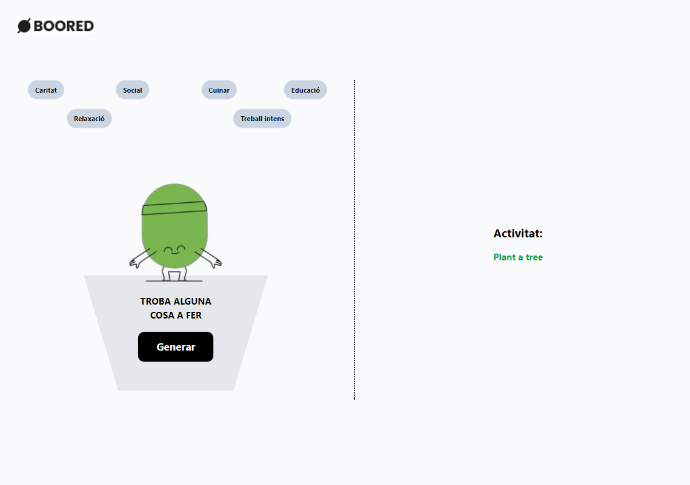

<div align="center"></div>

# BooredApp

This web application is a challange for applying to "SALÓ DE L'OCUPACIÓ" hackatón organized by Barcelona Activa.  
I'm frontEnd developer, i was finished React bootcamp from IT- Academy few months ago.  
 I fllowed the instructions and this is my responsive app 👌.

## Technologies Used

 


## Workflow Description:

1. The user could selects a filter from the `FiltersGroup`, which updates the filter state using the `IdeaContext`. If none filter is selected, so we get a random idea.(without filter)
2. `IdeaGenerator`'s button reset the error and idea state and then calls the `fetchIdea` function with the updated filter.
3. `fetchIdea` makes a request to the API to get a new activity and updates the `IdeaContext` with the received information.
4. `Activitat` displays the obtained idea or handles error states.

## Installation

1. Clone the repository:

   ```bash
   git clone https://github.com/tomi-casabona/booredApp
   ```

2. Navigate to the project directory:

   ```bash
   cd booredApp.git
   ```

3. Install the dependencies:

   ```bash
   npm install
   ```

4. Start the application:

   ```bash
   npm run dev
   ```

5. Open your browser and visit `http://localhost:{PortNumber}`.

## Usage

1. Use the filter bar at the top to select an activity category.
2. Click the "Generate" button to get a random idea from the selected category.
3. If no filter is selected, a random unfiltered activity will be displayed.

## Images

<div align="center"></div>
<div align="center"></div>
<div align="center"></div>
<div align="center"></div>
